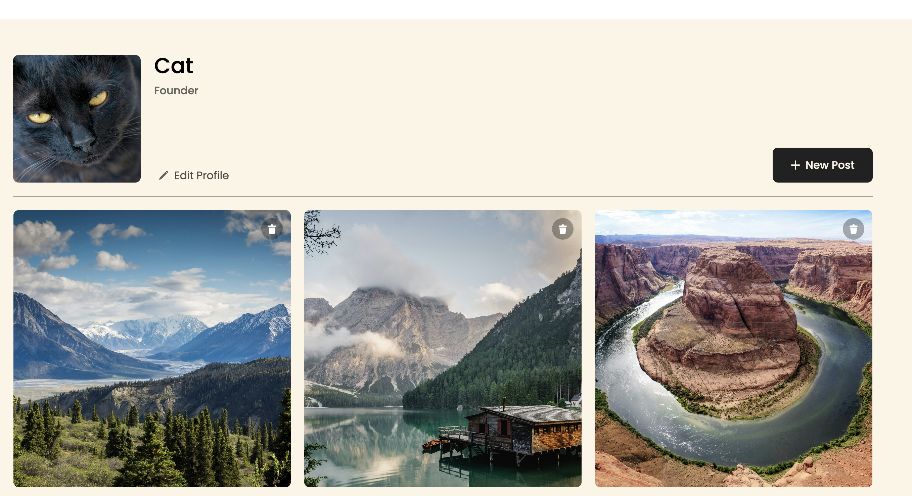
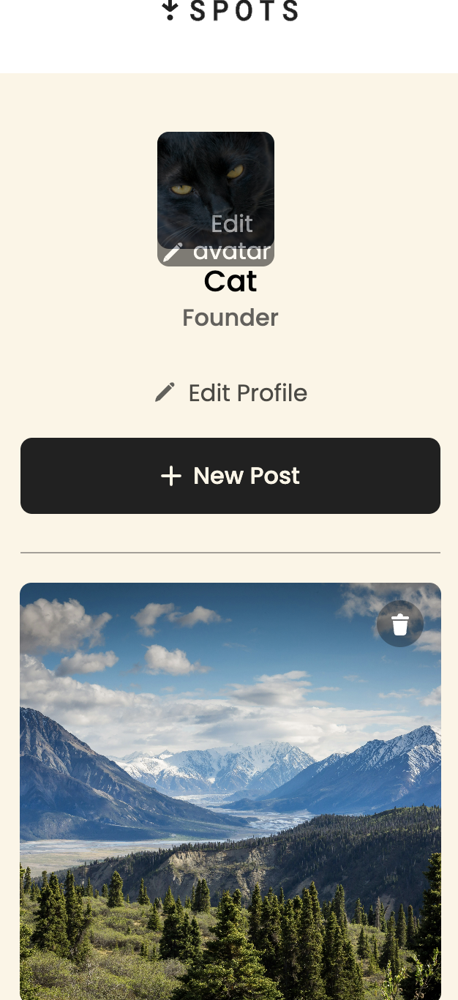

# Project 3: Spots

## Project Description

Spots is a responsive image-sharing web application that lets users create and interact with photo cards, update their profile, and explore images through an interactive interface. Built with HTML, CSS, and JavaScript, the project uses a REST API to manage and save user and card data while providing a seamless experience across desktop and mobile devices.

## Functionality

- Browse photo cards loaded from the server
- Add new photo cards with a title and image link
- Like and unlike photo cards
- Delete photo cards with a confirmation modal
- Open image previews in a modal
- Edit profile name and description
- Update the profile avatar
- Save profile and card changes to the server using API requests
- Open and close modals
- Close modals with the Escape key or by clicking the overlay
- Validate form inputs
- Disable submit buttons when form inputs are invalid
- Display loading states while forms are being submitted
- View a responsive layout across desktop, tablet, and mobile screens

## Technologies and Techniques Used

- HTML5
- CSS3
- JavaScript
- Flexbox
- CSS Grid
- Responsive Design
- BEM Methodology
- DOM manipulation
- Event listeners
- Form validation
- REST API integration
- Fetch API
- Promises and asynchronous JavaScript
- HTTP methods including GET, POST, PATCH, PUT, and DELETE
- Git
- GitHub

## Screenshots

- Desktop view
- Mobile view

Example:

## Live Project

https://mind2mine.github.io/se_project_spots/

## Project Pitch Video

https://www.loom.com/share/a2d8a0d4d2d747c19f4f06cae10819f7 first video
https://www.loom.com/share/8d108164358947fa9b3444db10d31511 second video
